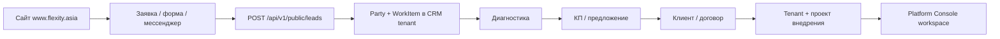

# Flexity Website Audit and Structure

**Дата аудита:** 2026-07-02  
**Проект:** Flexity  
**Категория:** `documentation_only` / `research_only`  
**Production:** не трогали. Deploy не делали. Код не меняли.

**Связанные документы:**
- [landing/README.md](../landing/README.md)
- [docs/ai/plans/2026-06-19-site-marketing-content-plan.md](ai/plans/2026-06-19-site-marketing-content-plan.md)
- [docs/ai/PRODUCT_ARCHITECTURE.md](ai/PRODUCT_ARCHITECTURE.md)
- [docs/ai/CHANGE_REQUESTS.md](ai/CHANGE_REQUESTS.md) — CR-2026-06-19-001

---

## 1. Цель аудита

Понять, насколько текущий сайт Flexity (`www.flexity.asia`) работает как **входная точка для заявок, диагностики и дальнейшего процесса в Flexity Core**, а не как статичная витрина продукта.

Задача этапа — зафиксировать:
- что уже есть;
- что понятно и непонятно посетителю;
- чего не хватает для воронки «заявка → диагностика → КП → клиент → tenant → проект»;
- смысловой каркас разделов (без переписывания дизайна и без deploy).

---

## 2. Где находится текущий сайт

| Параметр | Значение |
|----------|----------|
| **Live URL** | https://www.flexity.asia/ |
| **Источник в репозитории** | `landing/www/` |
| **Deploy path (сервер)** | `/var/www/flexity-landing/` |
| **Технология** | Статический HTML + Bootstrap 5.3.3 CDN + `assets/site.css` |
| **Контент-источники** | `landing/content/` (статьи, content-packs) |
| **Генератор Insights** | `scripts/content/generate_insights.py` |

**Не является публичным маркетинговым сайтом:**

| URL / путь | Назначение |
|------------|------------|
| `https://flexity.asia/console/*` | Platform Console (SPA) — продукт для авторизованных пользователей |
| `https://flexity.asia/api/v1/*` | Flexity Core backend (FastAPI) |
| `flexity.asia/` (корень без www) | Legacy Consult Flask (reference) |
| `platform-console/` | Исходники Console, отдельный deploy |

**Архитектура входных слоёв:**

```text
www.flexity.asia (landing/www)     → маркетинг, контент, заявки (план)
flexity.asia/console/              → Platform Console (CRM, workspace)
flexity.asia/api/v1/               → Flexity Core API
```

---

## 3. Текущая структура сайта

### 3.1 Карта страниц (main branch, production)

| URL | Файл | Статус |
|-----|------|--------|
| `/` | `landing/www/index.html` | Live, полный контент |
| `/solutions/` | `landing/www/solutions/index.html` | Live |
| `/solutions/clinic.html` | отраслевое направление | Live |
| `/solutions/consulting.html` | отраслевое направление | Live |
| `/solutions/kindergarten.html` | отраслевое направление | Live |
| `/solutions/trailers.html` | отраслевое направление | Live |
| `/insights/` | индекс статей | Live, 3 статьи |
| `/insights/ai-competition-news.html` | статья | Live |
| `/insights/ai-personal-content-assistant.html` | статья | Live |
| `/insights/ai-automation-daily-brief.html` | статья | Live |
| `/cases/` | placeholder | Live |
| `/calculators/` | индекс без рабочих калькуляторов | Live |
| `/demo/` | контакты, без HTML-формы | Live |

### 3.2 Разделы, которых нет

| Ожидаемый раздел | Статус |
|------------------|--------|
| `/services/` — услуги | **Отсутствует** |
| `/diagnostics/` — диагностика | **Отсутствует** |
| `/contacts/` — отдельная страница | Контакты на homepage и `/demo/` |
| `/ru/`, `/en/`, `/kk/` | Запланировано (Phase 2), не реализовано |
| Страницы модулей (Booking, ContentOps, AI) | **Отсутствуют** на сайте |

### 3.3 Навигация (единая на всех страницах)

Пункты меню: **Решения · Insights · Кейсы · Калькуляторы · Демо**

Кнопки в navbar:
- «Войти в систему» → `https://flexity.asia/console/login`
- «Запросить демо» → `/demo/`

### 3.4 Структура главной страницы

1. **Hero** — позиционирование Flexity как единой CRM/ERP-платформы
2. **#solutions** — 4 отраслевых направления (карточки)
3. **#benefits** — зачем бизнесу Flexity (3 блока)
4. **#how** — как начать (3 шага)
5. **#contacts** — email, WhatsApp/Telegram
6. **Footer**

### 3.5 Контент вне main (worktree, ещё не merged)

В worktree `content-bank-source-of-truth` подготовлено, но **не в production main**:
- HTML-форма заявки на `/demo/` → `POST /api/v1/public/leads`
- Backend endpoint `public_leads` + runbook
- Дополнительные статьи Insights (`crm-cash-gap`, `weekend-ai-life-planning`)

---

## 4. Что сейчас есть на сайте

### Продукт и позиционирование
- Чёткий месседж: Flexity — **один продукт**, а Clinic / Consulting / Kindergarten / Trailers — **направления внедрения**, не отдельные программы.
- Универсальный workflow: клиент → заявка → документ → оплата → исполнение.
- Честные оговорки: staging Console, поэтапное внедрение, без «магии из коробки».

### Решения (Solutions)
- Индекс + 4 отраслевые страницы с типовым контуром процесса.
- CTA на каждой странице: «Запросить демо», «Разобрать процесс».

### Контент (Insights)
- 3 опубликованные статьи (AI, ContentOps, автоматизация).
- Частичный SEO на insights (canonical, OG-теги на индексе и статьях).

### Инструменты воронки (каркас)
- `/cases/` — шаблон формата кейса + черновик карточки.
- `/calculators/` — список планируемых калькуляторов.
- `/demo/` — описание следующих шагов после обращения.

### Контакты и CTA
- Email: `info@flexity.asia`
- WhatsApp / Telegram: +7 705 324 9805
- Повторяющиеся CTA «Запросить демо» по всему сайту.

### Аналитика
- Yandex.Metrika (id `106756538`) — **только на homepage**.

### Документация и планы
- Master plan маркетинга (фазы 0–7).
- Content factory, insights publishing pipeline.
- Booking MVP описан в `docs/booking/`, но **не представлен на сайте**.

---

## 5. Что понятно

| Тема | Оценка |
|------|--------|
| Flexity — единая платформа, не набор разрозненных продуктов | **Понятно** для технически грамотного читателя |
| 4 отраслевых направления и общий workflow | **Понятно** на уровне схемы процесса |
| Как связаны клиент, заявка, документ, оплата | **Понятно** — это сильная сторона текущего копирайта |
| Куда нажать, чтобы связаться | **Частично понятно** — есть `/demo/` и мессенджеры |
| Что будет после обращения (созвон → демо staging → план) | **Понятно** на странице `/demo/` |
| Честность про roadmap (форма в разработке, пакеты в roadmap) | **Понятно** — снижает недоверие от ложных обещаний |

---

## 6. Что непонятно

### Для владельца бизнеса (не разработчика)

| Проблема | Пример с сайта |
|----------|----------------|
| **Слишком продуктовый язык** | «AI-ready CRM/ERP», «work item», «Platform Console», «staging» |
| **Неясно, кто вы для клиента** | Платформа? Студия внедрения? Консалтинг + разработка? |
| **Нет явного ответа «какую боль решаем»** | Есть workflow, но нет формулировки проблем: хаос в заявках, разрыв CRM и денег, потеря клиентов |
| **«Запросить демо» ≠ «оставить заявку»** | Демо звучит как показ интерфейса, а не как начало проектной работы |
| **Нет диагностики как понятного входа** | Клиент не понимает, с чего начать, если процесс ещё не описан |
| **Калькуляторы и кейсы — пустые обещания** | Пункты в меню ведут на placeholder — снижает доверие |
| **Booking, ContentOps, AI-сотрудники** | Есть в продуктовых планах, на сайте не упомянуты как модули/решения |

### Для целевой аудитории из ТЗ

Сайт **слабо объясняет**, что Flexity оказывает **услуги**:
- аудит процессов;
- автоматизация;
- разработка модулей;
- сопровождение.

Сейчас сайт читается как **описание платформы**, а не как **предложение помощи бизнесу**.

### Технические несоответствия

- `landing/README.md` указывает «Insights: статей нет» — фактически 3 статьи опубликованы.
- Favicon указан в HTML, файл может отсутствовать в `assets/`.
- Metrika не на внутренних страницах — нет полной картины воронки.

---

## 7. Чего не хватает

### Критичные пробелы для воронки

1. **Раздел «Услуги»** — что Flexity делает для клиента руками и по этапам.
2. **Раздел «Диагностика»** — бесплатная и платные форматы как главный вход в продажу.
3. **Рабочая форма заявки** с захватом в Flexity Core (в main — только мессенджеры).
4. **CTA «Пройти бесплатную диагностику»** — отдельный от «Запросить демо».
5. **Страницы модулей / готовых решений** — Booking, ContentOps, CRM Core, AI-сотрудники.
6. **Блок доверия** — реальные кейсы, подход, опыт, «кому подходит».
7. **Связка контента с CTA** — статьи Insights не ведут системно к диагностике/заявке.

### Вторичные пробелы

- SEO-база: `sitemap.xml`, `robots.txt`, meta matrix на всех страницах.
- Рабочие калькуляторы как lead magnets.
- RSS, мультиязычность.
- Единый стиль CTA по всей воронке.
- UTM-метки и цели Metrika на ключевых действиях.

---

## 8. Первый экран и позиционирование

### Текущий hero (главная)

- **Badge:** «Единая AI-ready CRM/ERP-платформа»
- **H1:** «Flexity — один продукт для сервисного и операционного бизнеса»
- **Подзаголовок:** клиника, консалтинг, детский сад, производство — направления внедрения; общий путь workflow.
- **CTA:** «Запросить демо» (primary), «Посмотреть решения» (secondary)
- **Примечание:** «Platform Console на staging…»

### Оценка

| Критерий | Оценка | Комментарий |
|----------|--------|-------------|
| Понятно, чем занимается Flexity | 🟡 Средне | Платформа — да; услуги внедрения — нет |
| Понятно, для кого сайт | 🟡 Средне | «Сервисный и операционный бизнес» — широко |
| Понятна решаемая проблема | 🔴 Слабо | Нет боли: хаос, потери, разрыв учёта |
| Сильный главный оффер | 🟡 Средне | Про продукт, не про результат для клиента |
| Понятный CTA | 🟡 Средне | «Демо» есть; диагностики и заявки — нет |

### Рекомендация по смыслу первого экрана (без смены дизайна)

Добавить **второй слой сообщения** поверх текущего (текстом, не визуалом):

> **Для кого:** владельцы и операционные директора, у которых процессы разъехались между Excel, мессенджерами и разными системами.  
> **Что делаем:** разбираем процесс, проводим диагностику, внедряем Flexity по этапам.  
> **Главный CTA:** «Бесплатная диагностика процесса» → `/diagnostics/free/` (новый раздел).  
> **Второй CTA:** «Запросить демо платформы» → `/demo/`.

Сохранить текущий продуктовый месседж для тех, кто уже понимает CRM/ERP — но не делать его единственным.

---

## 9. Услуги

### Что есть сейчас

Отдельного раздела **«Услуги»** нет. Услуги **не перечислены** явно. Косвенно упоминается:
- «Разобрать процесс» (CTA → `/demo/`)
- «Поэтапное внедрение» (benefits)
- «Пилот на Flexity staging» (how)

### Матрица услуг из ТЗ vs сайт

| Услуга | На сайте | Оценка |
|--------|----------|--------|
| Аудит процессов | Нет | 🔴 |
| Автоматизация бизнеса | Косвенно (AI, workflow) | 🟡 |
| Разработка модулей | Нет | 🔴 |
| CRM / tenant-система | Да (как продукт) | 🟢 |
| AI-сотрудники | Упоминание «AI-ready foundation» | 🟡 |
| ContentOps | Только в статье Insights | 🟡 |
| Интеграции | «Поэтапно» на Trailers | 🟡 |
| Сопровождение | Нет | 🔴 |

### Предлагаемый смысловой каркас `/services/`

Не финальные тексты — **структура раздела**:

```text
/services/
  ├── index.html          — обзор: Flexity как партнёр по автоматизации, не только SaaS
  ├── audit.html          — аудит процессов и операционной модели
  ├── automation.html     — автоматизация и связка CRM + документы + финансы
  ├── modules.html        — разработка и подключение отраслевых модулей
  ├── ai-employees.html   — AI-сотрудники и сценарии автоматизации рутины
  ├── contentops.html     — ContentOps / контент-контур (Маргося)
  ├── integrations.html   — интеграции с внешними системами
  └── support.html        — сопровождение и развитие после запуска
```

**Общий блок на каждой странице услуги:**
1. Для кого
2. Какая проблема
3. Что делаем
4. Результат для клиента
5. С чего начать (бесплатная диагностика → платная → проект)
6. CTA: «Оставить заявку» / «Записаться на диагностику»

**Связь с навигацией:** добавить пункт «Услуги» между «Решения» и «Insights» или объединить «Решения» (продукт) и «Услуги» (работа с клиентом) в два подпункта.

---

## 10. Диагностика

### Что есть сейчас

**Отдельной страницы диагностики нет.**

Ближайшие элементы:
- CTA «Разобрать процесс» → `/demo/`
- Статья в worktree `crm-cash-gap`: «Диагностика важнее названия инструмента» (ещё не в main/production)
- Текст на `/demo/`: «короткий созвон — уточняем процесс»

**Вывод:** диагностика как продукт входа **не оформлена**. Клиент не видит разницы между «демо», «разбором» и «диагностикой».

### Предлагаемая структура раздела

```text
/diagnostics/
  ├── index.html              — что такое диагностика Flexity и зачем она
  ├── free.html               — бесплатная диагностика
  ├── express.html            — экспресс-диагностика (платная)
  ├── automation.html         — диагностика автоматизации
  ├── crm-processes.html      — диагностика CRM / процессов
  ├── content.html            — диагностика контента / публикаций
  └── industry-module.html    — диагностика отраслевого модуля
```

**CTA на всех страницах диагностики:** форма заявки с полем `diagnostic_type` + fallback на WhatsApp.

---

### 10.1 Бесплатная диагностика

#### Сейчас
Не выделена. Ближайший аналог — созвон/переписка через `/demo/`.

#### Предлагаемый смысловой каркас `/diagnostics/free/`

| Элемент | Содержание |
|---------|------------|
| **Для кого** | Владелец или руководитель операций, который чувствует «что-то разъехалось», но ещё не готов к проекту |
| **Что проверяем** | 1–2 ключевых процесса: откуда приходят заявки, как оформляются документы, как фиксируются оплаты, где теряется информация |
| **Формат** | 30–45 мин созвон или структурированная переписка |
| **Что получает клиент** | Краткая карта «как сейчас» + 3–5 наблюдений + рекомендация следующего шага (платная диагностика / демо / ничего не делать) |
| **Результат** | Не КП и не внедрение — **ясность**, стоит ли идти дальше |
| **Следующий шаг** | Экспресс-диагностика, профильная платная диагностика или демо Flexity |
| **CTA** | «Записаться на бесплатную диагностику» |

**Позиционирование:** главный **низкопороговый вход** на сайте. Должен быть заметнее, чем «Запросить демо».

---

### 10.2 Платные диагностики

Смысловой каркас (не финальные цены и не юридические оферты):

#### Экспресс-диагностика

| Поле | Содержание |
|------|------------|
| Для кого | Нужно быстро понять масштаб проблемы перед решением о проекте |
| Что проверяем | Операционный контур за 1–2 дня: заявки, роли, документы, оплаты, узкие места |
| Результат | Документ 3–5 стр.: карта процесса, риски, приоритеты, ориентир по этапам |
| Следующий шаг | КП на внедрение / пилот / отказ |

#### Диагностика автоматизации

| Поле | Содержание |
|------|------------|
| Для кого | Бизнес с ручной рутиной, дублированием данных, хаосом в мессенджерах |
| Что проверяем | Повторяющиеся операции, точки ручного ввода, кандидаты на AI/интеграции |
| Результат | Карта автоматизации: quick wins + проектные задачи |
| Следующий шаг | Пилот модуля / поэтапное внедрение Flexity |

#### Диагностика CRM / процессов

| Поле | Содержание |
|------|------------|
| Для кого | «Нужна CRM», но неясно, CRM ли это; или воронка есть, но не работает |
| Что проверяем | Воронка, роли, SLA, связь сделки с документами и деньгами |
| Результат | Схема целевого контура + gap analysis относительно Flexity Core |
| Следующий шаг | Настройка tenant, пилот CRM workspace |

#### Диагностика контента / публикаций

| Поле | Содержание |
|------|------------|
| Для кого | Собственник или маркетинг, который тонет в контенте без системы |
| Что проверяем | Каналы, ритм, роли, связь контента с продажами |
| Результат | Карта ContentOps: что автоматизировать, что оставить человеку |
| Следующий шаг | Пилот ContentOps / модуль контента / сопровождение |

#### Диагностика отраслевого модуля

| Поле | Содержание |
|------|------------|
| Для кого | Клиника, детсад, производство, бронирование — нужен отраслевой сценарий |
| Что проверяем | Специфика отрасли vs универсальные модули Flexity |
| Результат | Рекомендация: template / industry package / кастомизация |
| Следующий шаг | Пилот отраслевого пакета (clinic_basic, kindergarten_basic, booking, trailers) |

**Общий принцип:** каждая платная диагностика **заканчивается артефактом**, а не только созвоном. Это отличает услугу от бесплатного входа и от «демо продукта».

---

## 11. Готовые решения / модули

### Что есть сейчас

На сайте представлены **4 отраслевых направления** (Solutions):
- Clinic
- Consulting
- Kindergarten
- Trailers

Это **направления внедрения**, не полный каталог модулей.

### Матрица модулей из ТЗ vs сайт

| Модуль / решение | На сайте | Комментарий |
|------------------|----------|-------------|
| **Booking** | 🔴 Нет | Есть `docs/booking/`, на сайте не представлен |
| **Clinic** | 🟢 Да | `/solutions/clinic.html` |
| **ContentOps / Маргося** | 🟡 Частично | Статья Insights, нет продуктовой страницы |
| **CRM / Core** | 🟡 Косвенно | Workflow на главной, нет отдельной страницы «Flexity Core» |
| **AI-сотрудники** | 🟡 Косвенно | «AI-ready foundation» в benefits |
| **Consulting** | 🟢 Да | Как направление |
| **Kindergarten** | 🟢 Да | Как направление |
| **Trailers** | 🟢 Да | Как направление |

### Предлагаемый смысловой каркас

Разделить **два слоя** на сайте (в навигации или на `/solutions/`):

**A. Отраслевые направления** (уже есть):
- Clinic, Consulting, Kindergarten, Trailers

**B. Модули и готовые контуры** (добавить каркас):

```text
/modules/   (или подраздел /solutions/modules/)
  ├── core.html           — Flexity Core: CRM, клиенты, документы, финансы
  ├── booking.html        — бронирование территорий и объектов
  ├── contentops.html     — ContentOps / контент-контур
  └── ai-employees.html   — AI-сотрудники и сценарии
```

**Каркас страницы модуля (не полный копирайт):**
1. Что это (модуль платформы, не отдельный продукт)
2. Для кого
3. Какие задачи закрывает
4. Как связан с Flexity Core
5. Статус (live / pilot / roadmap) — **честно**
6. CTA: диагностика → демо → заявка

**Важно:** Booking и ContentOps не обещать как «готовые из коробки», если статус MVP/pilot — указать стадию явно.

---

## 12. Блок доверия

### Что есть сейчас

| Элемент | Статус |
|---------|--------|
| Кейсы | Placeholder, один черновик без цифр |
| Insights / статьи | 3 статьи, в основном про AI и ContentOps |
| Опыт / команда | Нет |
| Подход к внедрению | Частично в «Как начать» и на solution pages |
| «Кому подходит Flexity» | Нет отдельного блока |
| Почему доверять | Нет социального доказательства |

### Что добавить (смысловой каркас)

```text
/trust/   (или секции на главной + отдельные страницы)
  ├── approach.html       — подход: диагностика → этапы → без «всё сразу»
  ├── for-whom.html       — кому подходит / кому не подходит (честный фильтр)
  ├── cases/              — наполнение реальными кейсами (сейчас placeholder)
  └── about.html          — кто стоит за Flexity (опыт, принципы)
```

**Минимальный блок доверия на главной (секция, не redesign):**
- 3 принципа: диагностика до внедрения · поэтапность · один продукт
- 1–2 цитаты/мини-кейса (когда появятся данные)
- Ссылка на Insights как экспертный контент
- «Кому не подходит» — повышает доверие (шаблонный SaaS без кастомизации процесса)

**Связка с Insights:** в конце каждой статьи — единый CTA-блок:
«Не уверены, с чего начать? → Бесплатная диагностика процесса».

---

## 13. Заявка и CTA

### Текущее состояние

| CTA | Куда ведёт | Проблема |
|-----|------------|----------|
| Запросить демо | `/demo/` | Нет формы — только контакты |
| Разобрать процесс | `/demo/` | То же самое, размывает смысл |
| Войти в систему | Console login | Для клиентов, не для лидов |
| Email / WhatsApp / Telegram | Внешние каналы | Нет захвата в CRM, нет UTM |

**На `/demo/` явно написано:** «Контактная форма — в разработке», «захват лидов в CRM — запланирован».

### Целевая логика CTA

| Уровень намерения | CTA | Страница |
|-------------------|-----|----------|
| Низкий (изучает) | Читать Insights / Калькулятор | Контент |
| Средний (есть проблема) | Бесплатная диагностика | `/diagnostics/free/` |
| Высокий (готов к разговору) | Оставить заявку | `/demo/` или `/contact/` |
| Продуктовый интерес | Запросить демо платформы | `/demo/` |
| Существующий пользователь | Войти в систему | Console |

### Форма заявки (целевые поля)

Уже спроектировано в worktree `content-bank-source-of-truth`:

- имя*
- телефон/email*
- компания
- `process_area` (отрасль / зона интереса)
- `diagnostic_type` (если пришёл с диагностики)
- message
- consent*
- honeypot
- UTM из query string

**Fallback:** WhatsApp / email остаются, но форма — primary path.

---

## 14. Связь сайта с Flexity Core

Сайт — **входной слой**. Flexity Core — **операционная система** после конверсии лида.

### Целевая цепочка



### Пошагово

| Шаг | Где | Сущности Flexity Core |
|-----|-----|------------------------|
| 1. Заявка с сайта | `/demo/`, форма, WhatsApp | — |
| 2. Лид в системе | `POST /api/v1/public/leads` | `Party` (контакт), `WorkItem` (заявка) в целевом tenant |
| 3. Диагностика | Созвон / платный артефакт | WorkItem stages, notes, activities в CRM |
| 4. КП | Документы | Модуль `documents` (КП, договор) |
| 5. Клиент | Продажа | Party → client role, finance |
| 6. Tenant | Внедрение | `tenants` + industry template/package |
| 7. Проект | Операции | Workspace, модули, подписка |

### Текущий статус интеграции

| Компонент | Main branch | Worktree / план |
|-----------|-------------|-----------------|
| Public leads API | ❌ Нет | ✅ `public_leads.py` + тесты |
| Форма на сайте | ❌ Статика | ✅ HTML form в demo |
| Runbook | ❌ | ✅ `2026-06-24-public-inbound-leads-runbook.md` |
| Env `PUBLIC_LEADS_ENABLED` | — | `false` by default |
| Telegram notify | — | Опционально |

**Безопасность (из runbook):**
- Endpoint выключен по умолчанию.
- Нужны: target tenant, pipeline, stage, user ID.
- Allowed origins: `https://www.flexity.asia` (без wildcard).

### Рекомендуемый tenant для inbound

Использовать **собственный операционный tenant Flexity** (не клиентский) как CRM для входящих лидов с сайта — отдельный pipeline «Сайт → Диагностика → Продажа».

---

## 15. Что не трогать сейчас

- Production deploy и nginx/systemd.
- Дизайн-систему и визуальный стиль (Bootstrap + `site.css`).
- Переписывание всех страниц целиком.
- Backend auth, tenant logic, subscriptions без отдельного approve.
- Миграции БД.
- Legacy Flask apps (Consult, Trailers, Clinic).
- Platform Console product features (S2.2, S2.3, W3.2+).
- Multilingual implementation.
- Social auto-publishing.
- Создание CMS — пока static + markdown pipeline достаточен.

---

## 16. Рекомендации

### Приоритет 1 — смысл и воронка (контент, без redesign)

1. **Добавить в план контента разделы** `/services/` и `/diagnostics/` со смысловыми каркасами из этого документа.
2. **Сделать «Бесплатная диагностика» главным CTA** рядом с «Запросить демо».
3. **Уточнить hero-текст** — добавить слой «для владельца бизнеса» и формулировку проблемы.
4. **В конце каждой статьи Insights** — единый CTA на диагностику.
5. **Обновить `landing/README.md`** — актуальный статус Insights, формы, roadmap.

### Приоритет 2 — захват лидов (отдельный approve, Phase 6)

1. Merge worktree: `public_leads` API + форма на `/demo/`.
2. Настроить runtime env на staging, проверить создание Party + WorkItem.
3. Включить `PUBLIC_LEADS_ENABLED=true` только после QA.
4. Добавить цели Metrika: submit, click WhatsApp, click diagnostic CTA.

### Приоритет 3 — доверие и модули

1. Опубликовать 1 реальный кейс (даже validation-формат без цифр).
2. Добавить каркас страниц модулей: Core, Booking, ContentOps, AI.
3. Опубликовать статью `crm-cash-gap` — она естественно ведёт к диагностике.

### Приоритет 4 — инфраструктура сайта

1. `sitemap.xml`, `robots.txt`
2. Meta matrix для всех страниц
3. Metrika на всех страницах
4. Favicon и social assets

### Принцип развития

```text
Сейчас:     витрина продукта + контакты
Цель:       входная точка → диагностика → лид в Core → проект
Метод:      маленькие контентные шаги + один технический шаг (форма лидов)
Не делать:  большой редизайн или новую архитектуру сайта
```

---

## 17. Следующий этап

### Рекомендуемая последовательность

| # | Этап | Тип | Файлы | Approve |
|---|------|-----|-------|---------|
| 1 | Утвердить этот аудит и смысловые каркасы | docs | этот файл | пользователь |
| 2 | Implementation plan: контент `/diagnostics/free/` + `/services/index` | docs + static HTML | `landing/www/`, plan в `docs/ai/plans/` | отдельный |
| 3 | Обновить hero и CTA (только текст) | static | `landing/www/index.html` | отдельный |
| 4 | Merge + staging QA public leads | backend + landing | `backend/`, `landing/www/demo/` | Phase 6 approve |
| 5 | CTA block в Insights template | static generator | `scripts/content/`, insights HTML | отдельный |
| 6 | Первый реальный кейс | static | `landing/www/cases/` | отдельный |

**Следующий безопасный шаг после approval этого документа:**

Создать implementation plan на **минимальный контентный слайс**:
- одна страница `/diagnostics/free.html` (каркас);
- одна страница `/services/index.html` (каркас);
- правка текста hero и одного primary CTA на главной;
- без deploy до отдельного решения.

---

## 18. HQ Summary

1. **Сайт сейчас:** рабочая статическая витрина продукта Flexity на `landing/www/` (www.flexity.asia) с 13 HTML-страницами: главная, 4 solutions, 3 insights, cases/calculators/demo placeholders. Хорошо объясняет единый продукт и workflow, но **не оформлен как воронка услуг и диагностики**. Форма заявки и API лидов есть только в worktree, не в production main.

2. **Главные проблемы:** нет разделов «Услуги» и «Диагностика»; CTA «Запросить демо» не конвертирует в системный лид; язык слишком продуктовый/технический для владельца бизнеса; кейсы и калькуляторы пустые; модули Booking/ContentOps/AI не представлены; сайт не связан с Flexity Core операционно.

3. **Что нужно добавить:** смысловые разделы Services + Diagnostics (бесплатная + 5 платных форматов); страницы модулей; блок доверия; форма → `POST /api/v1/public/leads` → Party + WorkItem; единая логика CTA по воронке.

4. **Что можно быстро исправить:** тексты hero и CTA; CTA в конце статей Insights; обновить `landing/README.md`; опубликовать статью про диагностику CRM; добавить каркасные HTML-страницы без смены дизайна.

5. **Что требует отдельной работы:** merge и production enable public leads API; реальные кейсы с согласованием клиентов; рабочие калькуляторы; страницы Booking/ContentOps с честным статусом MVP; SEO-база; multilingual; Metrika goals на всём сайте.

6. **Следующий шаг:** утвердить этот аудит → создать implementation plan на минимальный слайс «бесплатная диагностика + услуги (каркас) + правка CTA на главной» → затем отдельный approve на Phase 6 (форма лидов в Core).

---

*Документ подготовлен по состоянию репозитория Flexity (main branch) и публичного сайта www.flexity.asia на 2026-07-02. Production не изменялся.*
