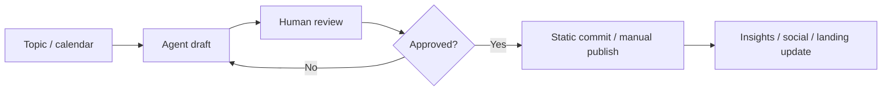

# Master Plan: Public Site, Content, Multilingual, Marketing Operations

**Дата:** 2026-06-19  
**Статус:** docs-only — код не писать до отдельного approve по фазам  
**Change Request:** [CR-2026-06-19-001](../CHANGE_REQUESTS.md#cr-2026-06-19-001-public-site-content-funnel-multilingual-and-marketing-operations)  
**Связанные документы:**

- [CHANGE_REQUESTS.md](../CHANGE_REQUESTS.md)
- [ORCHESTRATION.md](../ORCHESTRATION.md)
- [PRODUCT_ARCHITECTURE.md](../PRODUCT_ARCHITECTURE.md)
- [landing/README.md](../../landing/README.md)
- [2026-06-10-console-and-landing-deploy-prep-plan.md](2026-06-10-console-and-landing-deploy-prep-plan.md)

---

## Classification

| Поле | Значение |
|------|----------|
| **Project** | Flexity |
| **Category** | `documentation_only` / product marketing plan |
| **Risk** | low |
| **Backend changes** | **forbidden** в этом плане |
| **Landing / console code** | **forbidden** в этом плане |
| **Deploy / nginx / systemd** | **forbidden** в этом плане |

### Task Classification (coordinator)

1. **Project:** Flexity  
2. **Category:** `documentation_only`  
3. **Risk level:** low  
4. **Intended scope:** `docs/ai/plans/`, `docs/ai/CHANGE_REQUESTS.md`, `landing/README.md`  
5. **Forbidden scope:** `backend/`, `platform-console/`, `landing/www/`, `deploy/`, nginx/systemd, legacy Flask, content agent implementation, i18n implementation  
6. **Required plan:** этот документ → approval → работа по фазам в отдельных ветках/PR  

---

## Goal

Зафиксировать единый master plan, чтобы будущая работа **не смешивала** в одной ветке:

- публичный сайт / landing;
- маркетинг и target/social readiness;
- news / insights / content layer;
- daily content agent;
- мультиязычность RU/EN/KZ;
- CRM lead capture;
- продуктовые фичи S2.2, S2.3, W3.2+.

Flexity остаётся **единым продуктом**. Clinic, Consulting, Kindergarten и Trailers — направления внедрения и reference systems, не отдельные CRM/ERP.

---

## A. Current State

### Уже готово

| Область | Состояние |
|---------|-----------|
| **Публичный сайт** | Статика в `landing/www/`, deploy на `www.flexity.asia` |
| **Homepage** | `landing/www/index.html` — единое позиционирование Flexity |
| **Solutions** | `solutions/` — индекс + `clinic`, `consulting`, `kindergarten`, `trailers` |
| **Insights** | `insights/index.html` — индекс рубрик (каркас) |
| **Cases** | `cases/index.html` — placeholder + формат |
| **Calculators** | `calculators/index.html` — индекс, страницы «готовится» |
| **Demo** | `demo/index.html` — статика, контакты |
| **CTA** | Кнопки на demo/contacts; «Войти в систему» → `https://flexity.asia/console/login` |
| **Yandex.Metrika** | Частично подключена на публичном сайте |
| **Platform Console login** | Branded login (S2.1), deploy на `flexity.asia/console/` |
| **Russian-first Console UI** | S2.1b — русские labels/formatters без полного i18n |
| **W3.1 Manager Operations** | CRM, клиенты, заявки, dashboard, documents/finance read-only в workspace |
| **Product direction** | CR-2026-06-18-001 — single Flexity product |

### Ещё не готово

| Область | Статус |
|---------|--------|
| Реальные статьи / blog posts | Нет |
| RSS | Нет |
| `sitemap.xml` | Нет |
| `robots.txt` | Нет |
| SEO/meta matrix (title, description, OG) | Нет системной матрицы |
| CRM lead form на сайте | Нет (только контакты/demo статика) |
| Social auto-publishing | Нет |
| Daily content agent | Нет |
| Multilingual RU/EN/KZ | Только план; RU root на сайте, RU-first в console |
| User onboarding / invites | S2.3 — не реализовано |
| Password reset | S2.3 — не реализовано |
| S2.2 redirect after login | Не реализовано |
| W3.2 documents (полный контур) | Read-only foundation |
| W3.3 finance (полный контур) | Read-only foundation |
| W3.4 packages / subscriptions / entitlements | Console admin частично; product entitlements — позже |

---

## B. Roadmap (Phases)

Каждая фаза — **отдельная ветка / отдельный PR** после закрытия текущего накопленного work.

### Phase 0 — Close current branch/PR

**Цель:** завершить и смержить накопленную работу (`feature/w3-1-manager-operations` и связанные S2.1/S2.1b).

| Действие | Примечание |
|----------|------------|
| Merge PR с W3.1, branded login, RU UI polish | Не продолжать всё в одной ветке |
| Зафиксировать deploy baseline | Console + landing на staging/production |
| Обновить SESSION / handoff при необходимости | Только docs |

**Out of scope:** новые фичи, marketing automation.

---

### Phase 1 — Public site funnel

**Цель:** честная контент-воронка без backend.

| Deliverable | Описание |
|-------------|----------|
| Homepage | Уточнение CTA, единый месседж |
| Solution pages | 4 направления + общий solutions index |
| Insights / cases / calculators / demo | Каркас → наполнение статикой |
| CTA | Demo, contacts, login — без ложных обещаний |
| Deploy | Только `landing/www/` → `/var/www/flexity-landing/` |

**Rules:**

- Не обещать готовый CRM lead capture.
- Не обещать multilingual как «уже работает».
- Не трогать backend.

---

### Phase 2 — Multilingual foundation RU/EN/KZ

**Цель:** архитектура языков — **план и структура**, без полной реализации в первом слайсе.

| Область | Подход |
|---------|--------|
| Public site | Целевые URL: `/ru/`, `/en/`, `/kk/`; сейчас RU root остаётся |
| Console | `i18n/{ru,en,kk}.ts`, language provider, localStorage / user pref позже |
| Migration | Переход root → `/ru/` — запланировать, не делать сейчас |

**Out of scope (initial slice):** полная i18n implementation, tenant-level language settings.

---

### Phase 3 — Content / insights layer

**Цель:** шаблоны и рубрики для статического контента.

| Deliverable | Описание |
|-------------|----------|
| Article template | HTML/markdown → static page |
| Case template | Формат кейса (проблема → решение → результат) |
| Rubric structure | Insights: CRM, учёт, автоматизация, отрасли |
| Первый контент | Статика в `landing/www/`, без CMS |

**Out of scope:** CMS, backend blog API, RSS (можно добавить позже в этой фазе как static `rss.xml`).

---

### Phase 4 — Daily content agent

**Цель:** workflow «черновик → human approval», без автопубликации.

**Ежедневный output (draft only):**

- topic of the day;
- business explanation (простым языком);
- Instagram post;
- Telegram post;
- Reels script;
- Insights article outline;
- CTA suggestion;
- UTM suggestion.

**Rules:**

| Rule | Обязательно |
|------|-------------|
| No direct publishing | Первые итерации — только файлы/PR для review |
| Human approval | Любой публичный текст — после человека |
| No news copy-paste | Пересказ + источники для current events |
| Fact checking | Для новостей и цифр — проверка источника |
| No false product claims | Не писать, что S2.2/W3.2 «уже в проде», если нет |

**Out of scope (initial):** social API, credentials, cron на сервере.

---

### Phase 5 — Target / social readiness

**Цель:** готовность к кампаниям до paid ads.

**Before paid ads checklist:**

- [ ] Рабочий demo/contact route
- [ ] Понятный CTA на каждой рекламируемой странице
- [ ] Минимум один landing на направление (clinic / consulting / kindergarten / trailers)
- [ ] Analytics baseline (Yandex.Metrika)
- [ ] Manual lead handling SLA (кто отвечает, за сколько часов)
- [ ] UTM convention (см. раздел F)

**Pixels:**

- Yandex.Metrika — baseline (частично есть);
- Meta Pixel — **отдельный approve** + privacy/consent review;
- Никаких ad pixels без согласования.

**Out of scope:** CRM form, auto lead routing.

---

### Phase 6 — CRM lead capture

**Цель:** публичная форма → Party + WorkItem в Flexity CRM.

| Компонент | Требование |
|-----------|------------|
| Public form | Отдельный backend slice |
| Spam protection | rate limit, honeypot / captcha — TBD |
| Consent | GDPR/152-FZ style checkbox + privacy link |
| Source / UTM | Сохранять utm_* и referrer |
| CRM | Create Party + WorkItem через Flexity API |
| Approval | **Отдельный backend implementation plan обязателен** |

**Out of scope до approve:** любые изменения `backend/`, auth, production deploy form endpoint.

---

### Phase 7 — Product continuation

Возврат к продуктовым фичам **после** стабилизации marketing/docs track или параллельно в отдельных ветках:

| ID | Фича | Кратко |
|----|------|--------|
| **S2.2** | Redirect after login | provider → tenants; tenant user → workspace |
| **S2.3** | User onboarding | invites, password reset, membership flows |
| **W3.2** | Documents | полный контур документов в workspace |
| **W3.3** | Finance | счета, оплаты, дебиторка — операционный контур |
| **W3.4** | Packages / subscriptions / entitlements | тарифы, модули, entitlements в продукте |

Marketing track **не блокирует** product track, но **не смешивается** в одном PR.

---

## C. Landing / Site Plan

### Роли разделов

| Раздел | Роль | Текущий путь |
|--------|------|--------------|
| **Homepage** | Единый вход: что такое Flexity, CTA demo/login | `/` |
| **Solutions** | Направления внедрения (не отдельные продукты) | `/solutions/` |
| **Insights** | Экспертный контент, рубрики | `/insights/` |
| **Cases** | Социальное доказательство, формат кейсов | `/cases/` |
| **Calculators** | Lead magnet / полезность (позже) | `/calculators/` |
| **Demo** | Запрос демо, контакты | `/demo/` |
| **Contacts** | В demo или отдельная страница позже | TBD |
| **CTA** | Demo → login → console | Честные формулировки |

### Solution pages

| Page | Аудитория | Сообщение |
|------|-----------|-----------|
| `clinic.html` | Клиники | Учёт, CRM, документы — через Flexity modules |
| `consulting.html` | Консалтинг | Проекты, клиенты, счета |
| `kindergarten.html` | Детские сады | Tenant/template, не отдельное приложение |
| `trailers.html` | Производство прицепов | industry_trailers direction |

### Позже (Phase 1–3 / SEO slice)

- SEO title/description matrix per page;
- `sitemap.xml`, `robots.txt`;
- OpenGraph / Twitter cards;
- canonical URLs при миграции на `/ru/`;
- structured data (Organization, Product) — с осторожностью.

### Deploy boundaries

| Что | Куда |
|-----|------|
| Static site | `landing/www/` → `/var/www/flexity-landing/` |
| Console SPA | `platform-console/dist/` → `/opt/flexity/coreops/platform-console/dist/` |
| API | `flexity.asia/api/v1/*` — backend, не landing |

**Не менять** nginx/systemd без отдельного deploy plan.

---

## D. Multilingual Plan

### Public site — целевая URL-стратегия

```
/ru/   — русский (default market)
/en/   — English
/kk/   — қазақша
```

### Текущая реализация (не менять сейчас)

- **RU root** (`www.flexity.asia/`) остаётся основным entry point.
- Миграция `index.html` → `/ru/index.html` + redirects — **запланировать в Phase 2**, не implement сейчас.
- Дублирование контента EN/KK — статика или build-time generation позже.

### Console — целевая архитектура

```
platform-console/src/i18n/
  ru.ts      # текущий ruUi.ts эволюционирует
  en.ts
  kk.ts
  index.ts   # provider, t(), formatters
```

| Уровень | Когда |
|---------|-------|
| Russian-first (сейчас) | `ruUi.ts`, display formatters |
| Language provider | Phase 2 implementation |
| localStorage preference | Phase 2 |
| User/tenant preference | Phase 2+ / tenant customization CR |

### Content agent + multilingual

- Agent генерирует черновики **по языку кампании** (RU primary).
- EN/KK версии — human review, не machine-only publish.

---

## E. Content Agent Plan

### Workflow



### Daily draft package (пример структуры файла)

```text
docs/content/drafts/YYYY-MM-DD-topic-slug/
  topic.md
  business-explanation.md
  instagram.md
  telegram.md
  reels-script.md
  insights-outline.md
  cta-and-utm.md
  sources.md
```

### Quality gates

1. Соответствие single-product narrative (CR-2026-06-18-001).
2. Нет обещаний неготовых фич (сверка с CHANGE_REQUESTS и roadmap).
3. Источники для фактов и новостей.
4. CTA ведёт на существующий route (demo, solutions, login).
5. UTM согласован с Phase 5 policy.

### Explicitly forbidden (until separate approve)

- Прямая публикация в Instagram/Telegram API;
- Автоматический commit в `landing/www/` без review;
- Генерация персональных данных / fake testimonials.

---

## F. Target / Social Plan

### Pre-ads checklist

| # | Item |
|---|------|
| 1 | Demo/contact route отвечает 200 |
| 2 | CTA виден above the fold на landing направления |
| 3 | UTM convention документирована |
| 4 | Metrika goals для demo click, login click |
| 5 | SLA на ручную обработку лидов (email/Telegram) |
| 6 | Privacy note на demo page |

### UTM convention

| Parameter | Пример | Назначение |
|-----------|--------|------------|
| `utm_source` | `instagram`, `yandex`, `telegram` | Источник трафика |
| `utm_medium` | `cpc`, `social`, `email` | Канал |
| `utm_campaign` | `kindergarten_q3_2026` | Кампания |
| `utm_content` | `carousel_slide_2` | Вариант креатива |
| `utm_term` | `crm_детский_сад` | Ключевое слово (paid search) |

**Пример URL:**

```
https://www.flexity.asia/demo/?utm_source=instagram&utm_medium=social&utm_campaign=flexity_launch&utm_content=reel_01
```

### Analytics

| Tool | Status | Next |
|------|--------|------|
| Yandex.Metrika | Partial on site | Goals, webvisor policy |
| Meta Pixel | Not deployed | Separate CR + consent banner |
| Google Analytics | Not planned default | Only if needed |

### Manual lead handling (до Phase 6)

1. Лид приходит на email / Telegram / форма demo (статика).
2. Ответ в SLA (например 24h business hours).
3. Ручное создание Party/WorkItem в Console workspace.
4. UTM фиксируется в заметке заявки.

---

## G. Branching & PR Policy

Чтобы не смешивать треки:

| Track | Пример ветки | Пример PR title |
|-------|--------------|-----------------|
| Product S2.x / W3.x | `feature/s2-2-login-redirect` | `feat(console): post-login redirect` |
| Landing content | `content/insights-article-01` | `content(landing): add insights article` |
| i18n | `feature/i18n-foundation` | `feat(console): i18n provider ru/en/kk` |
| Content agent | `docs/content-agent-workflow` | docs only first |
| CRM lead capture | `feature/public-lead-capture` | requires backend plan |

**Rule:** один PR — одна фаза / один слайс.

---

## Acceptance Criteria (для этого docs plan)

- [x] Master plan создан в `docs/ai/plans/`
- [x] CR-2026-06-19-001 добавлен в CHANGE_REQUESTS.md
- [x] `landing/README.md` обновлён со статусом и границами roadmap
- [ ] Codex review APPROVE
- [ ] Phase 0 merge выполнен
- [ ] Следующий implementation plan по выбранной фазе (1 или 7)

---

## Next Safe Step

1. Codex review этого plan + CR.  
2. Merge `feature/w3-1-manager-operations` (Phase 0).  
3. Выбрать **один** следующий track:
   - **Phase 1:** наполнение insights/cases статикой; или
   - **Phase 7:** S2.2 login redirect implementation plan.

---

## Files Intentionally Not Touched

- `backend/**`
- `platform-console/**`
- `landing/www/**`
- `deploy/**`
- legacy Flask projects
- `.env` / secrets
- `Flexity.code-workspace`
