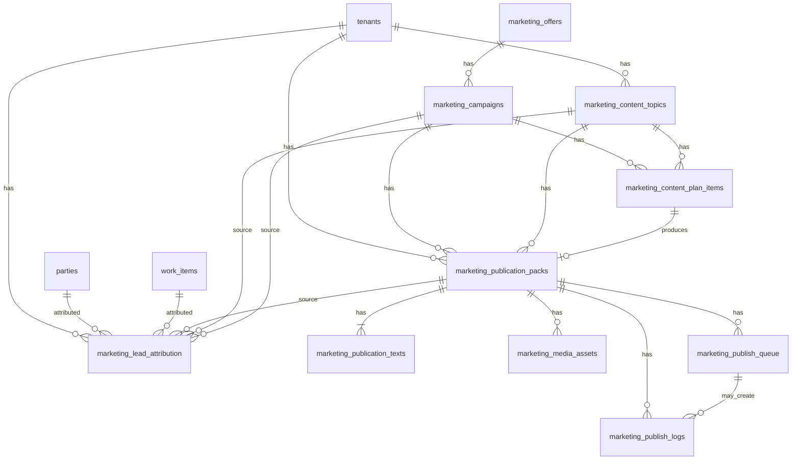

# M2 — Marketing Cabinet Data Model Draft

**Дата:** 2026-07-09  
**Проект:** Flexity / `coreops-platform`  
**Фаза:** M2 — data model draft  
**Категория:** `documentation_only`  
**Статус:** draft schema — **код не менялся, migrations не создавались**

**Родительские документы:**
- [2026-07-03-marketing-content-cabinet-product-tz.md](./2026-07-03-marketing-content-cabinet-product-tz.md) (M0)
- [2026-07-09-margosya-to-cabinet-audit.md](../research/2026-07-09-margosya-to-cabinet-audit.md) (M1)

**HQ approval:** documentation-only. Код, migrations, production, deploy, Margosya bot — **не трогать**.

---

## Task Classification

| Поле | Значение |
|------|----------|
| **Project** | Flexity |
| **Category** | `documentation_only` |
| **Risk level** | low |
| **Intended scope** | `docs/ai/plans/2026-07-09-marketing-cabinet-data-model-draft.md` |
| **Forbidden scope** | код, migrations, production, deploy, Margosya bot, Core public inbound, Booking / Clinic / Trailers |
| **Required plan** | M2 data model draft (этот документ) |

---

## 1. Goal

### 1.1 Зачем нужна эта модель

Перенести бизнес-логику ContentOps / Margosya в **Marketing Cabinet** (PostgreSQL + API + Console UI) **без потери** текущих рабочих сценариев Асем:

- выбор темы из content bank;
- создание publication pack (4 канала);
- загрузка visual asset;
- preflight → approve → publish;
- publish log;
- связь контента с лидами в Core.

### 1.2 Что модель должна решить

| Задача | Как решает модель |
|--------|-------------------|
| Единый source of truth | Marketing entities в PostgreSQL, не в git/Margosya state |
| Tenant isolation | `tenant_id` на каждой таблице; MVP = `flexity-sales` |
| Связь с Core CRM | Soft FK `party_id`, `work_item_id` — без дублирования CRM |
| Переход от git packs | Legacy fields + import mapping; git = transition mirror |
| MVP scope guard | Явный subset таблиц для M6 |
| Fail-closed rules | Статусы и constraints отражают gates из Margosya |

### 1.3 Что модель **не** решает

- UI wireframes (M3)
- REST API contract (M4)
- Alembic migrations (M5+)
- Object storage implementation
- Channel token vault

---

## 2. Source materials

### 2.1 Product & audit

| Документ | Что взяли |
|----------|-----------|
| M0 product TZ | Сущности §6, MVP §7, Core integration §10 |
| M1 Margosya audit | Feature matrix, pack file structure, status lifecycle, fail-closed gates |

### 2.2 Flexity Core (существующие сущности)

| Core entity | Table | Ключевые поля для связи |
|-------------|-------|-------------------------|
| **Tenant** | `tenants` | `id`, `slug` (`flexity-sales`) |
| **Party** | `parties` | `id`, `tenant_id`, `party_type`, `metadata_json` |
| **WorkItem** | `work_items` | `id`, `tenant_id`, `primary_party_id`, `source`, `custom_fields_json` |
| **Activity / Task** | `activities`, `tasks` | follow-up после lead (не в Marketing Cabinet) |
| **DocumentInstance** | `document_instances` | КП — в Core, не в Marketing |
| **Audit** | `audit` module | approve/publish events → audit log |

**Паттерны Flexity ORM (для будущей реализации):**
- `UUIDPrimaryKeyMixin` — `id` UUID PK
- `TimestampMixin` — `created_at`, `updated_at`
- `AuditUserMixin` — `created_by_user_id`, `updated_by_user_id`
- `tenant_id` FK → `tenants.id` ON DELETE CASCADE, indexed

### 2.3 Interim git / Margosya artifacts

| Artifact | Location | Maps to |
|----------|----------|---------|
| Content bank | `docs/content/flexity-content-bank.md` | `marketing_content_topics` |
| Pack metadata | `landing/content/content-packs/<dir>/pack.yml` | `marketing_publication_packs` |
| Channel texts | `telegram.md`, `instagram.md`, `threads.md`, `insights.md` | `marketing_publication_texts` |
| Channel config | `instagram.yml`, `threads.yml`, `tiktok.yml`, `visual.yml` | pack `config_json` + media |
| Publish events | `publish_log.yml` → `events[]` | `marketing_publish_logs` |
| Visual file | `landing/www/assets/social/<dir>/instagram-feed.png` | `marketing_media_assets` |
| Margosya session | `state/*.json(l)` | ephemeral; **не мигрировать** как SoT |

**Pack count (M1):** 16 directories в `landing/content/content-packs/`.

---

## 3. Architecture position

### 3.1 Ownership map

```text
┌─────────────────────────────────────────────────────────────────┐
│                    MARKETING CABINET (PostgreSQL)                │
│  topics · plan · campaigns · offers · packs · texts · media     │
│  publish_queue · publish_logs · channel_connections · reminders │
│  lead_attribution (context only)                                 │
└────────────────────────────┬────────────────────────────────────┘
                             │ soft FK (party_id, work_item_id)
                             ▼
┌─────────────────────────────────────────────────────────────────┐
│                         FLEXITY CORE                             │
│  tenants · parties · work_items · pipelines · documents · tasks  │
└────────────────────────────┬────────────────────────────────────┘
                             │
         ┌───────────────────┴───────────────────┐
         ▼                                       ▼
┌─────────────────┐                    ┌─────────────────┐
│ Margosya (bot)  │                    │ Website/Insights │
│ Telegram UI     │                    │ rendered output  │
│ → Cabinet API   │                    │ → Core leads API │
└─────────────────┘                    └─────────────────┘

Transition layer (temporary):
  git repo packs ← export/import mirror during M6 transition
```

### 3.2 Marketing Cabinet owns

| Domain | Tables |
|--------|--------|
| Content topics | `marketing_content_topics` |
| Content plan | `marketing_content_plan_items` |
| Campaigns / offers | `marketing_campaigns`, `marketing_offers` |
| Publication packs | `marketing_publication_packs`, `marketing_publication_texts` |
| Media metadata | `marketing_media_assets` |
| Publish orchestration | `marketing_publish_queue`, `marketing_publish_logs` |
| Channel config metadata | `marketing_channel_connections` |
| Reminders | `marketing_reminders` |
| Attribution context | `marketing_lead_attribution` |

### 3.3 Core owns

| Domain | Tables |
|--------|--------|
| Lead / client identity | `parties`, `work_items` |
| CRM pipeline | `pipelines`, `pipeline_stages` |
| Tenant scope | `tenants` |
| Commercial docs | `document_instances` |
| Follow-up tasks | `tasks`, `activities` |
| Lead conversion | stage transitions, `party_type` changes |

**Правило:** Marketing Cabinet **не создаёт** отдельные lead/deal tables.

### 3.4 Margosya owns

| Domain | Where |
|--------|-------|
| Telegram polling / send | `margosya-os` bot process |
| Reply + inline keyboards | bot UI layer |
| Photo download from Telegram | transport |
| User whitelist | `TELEGRAM_ALLOWED_USER_IDS` |
| Notification formatting | message templates |

**Target:** Margosya вызывает Marketing Cabinet API; не пишет YAML напрямую.

### 3.5 Git repo (transition only)

| Phase | Role |
|-------|------|
| M6 transition | Export pack → git for GHA publish scripts |
| Target | Publishers read from API or export job; git mirror optional |
| Final | **Not** source of truth |

---

## 4. Proposed entities

**Соглашения:**
- Все PK: `UUID`
- Все marketing tables: prefix `marketing_`
- Все tables: `tenant_id` NOT NULL, indexed
- Enums: `native_enum=False` (как в Core)
- JSON columns: `*_json` suffix
- Soft-delete: не в MVP; use `archived` status

---

### 4.1 `marketing_offers`

**Назначение:** что продаём — услуги, пакеты, ценностное предложение.

| Column | Type | Nullable | Notes |
|--------|------|----------|-------|
| `id` | UUID | PK | |
| `tenant_id` | UUID | FK → tenants | indexed |
| `title` | VARCHAR(255) | NOT NULL | |
| `description` | TEXT | NULL | |
| `target_audience` | TEXT | NULL | |
| `cta` | VARCHAR(512) | NULL | call to action text |
| `linked_diagnosis_slug` | VARCHAR(128) | NULL | link to `/diagnostics/` page |
| `status` | ENUM | NOT NULL | `draft`, `active`, `archived` |
| `metadata_json` | JSONB | NOT NULL default `{}` | future extensions |
| `created_by_user_id` | UUID | NULL | AuditUserMixin |
| `updated_by_user_id` | UUID | NULL | |
| `created_at` | TIMESTAMPTZ | NOT NULL | |
| `updated_at` | TIMESTAMPTZ | NOT NULL | |

**Indexes:** `(tenant_id, status)`, `(tenant_id, title)`

**MVP:** deferred (see §9).

---

### 4.2 `marketing_campaigns`

**Назначение:** период + цель + каналы + UTM narrative.

| Column | Type | Nullable | Notes |
|--------|------|----------|-------|
| `id` | UUID | PK | |
| `tenant_id` | UUID | FK | |
| `offer_id` | UUID | FK → marketing_offers | NULL |
| `title` | VARCHAR(255) | NOT NULL | |
| `goal` | VARCHAR(64) | NOT NULL | `leads`, `awareness`, `demo`, `conversion` |
| `start_date` | DATE | NULL | |
| `end_date` | DATE | NULL | |
| `status` | ENUM | NOT NULL | `planned`, `active`, `completed`, `paused` |
| `channels` | JSONB | NOT NULL default `[]` | e.g. `["telegram","instagram"]` |
| `utm_params_json` | JSONB | NOT NULL default `{}` | template UTM |
| `budget_amount` | NUMERIC(18,2) | NULL | |
| `budget_currency` | VARCHAR(3) | NULL | |
| `created_by_user_id` | UUID | NULL | |
| `updated_by_user_id` | UUID | NULL | |
| `created_at` | TIMESTAMPTZ | NOT NULL | |
| `updated_at` | TIMESTAMPTZ | NOT NULL | |

**Indexes:** `(tenant_id, status)`, `(tenant_id, offer_id)`

**MVP:** deferred; `campaign_id` nullable on other tables for manual link later.

---

### 4.3 `marketing_content_topics`

**Назначение:** approved content bank topics (import from markdown + manual create).

| Column | Type | Nullable | Notes |
|--------|------|----------|-------|
| `id` | UUID | PK | |
| `tenant_id` | UUID | FK | |
| `legacy_topic_id` | VARCHAR(64) | NULL | e.g. `CB-2026-06-28-015`; unique per tenant |
| `title` | VARCHAR(512) | NOT NULL | |
| `rubric` | VARCHAR(128) | NOT NULL | content bank rubric |
| `angle` | TEXT | NULL | |
| `source` | VARCHAR(64) | NOT NULL default `manual` | `content_bank`, `manual`, `brainstorm`, `news` |
| `status` | ENUM | NOT NULL | see §5.1 |
| `priority` | INTEGER | NOT NULL default 0 | higher = sooner in selector |
| `reusable` | BOOLEAN | NOT NULL default false | |
| `recommended_channels` | JSONB | NOT NULL default `[]` | from content bank |
| `used_count` | INTEGER | NOT NULL default 0 | denormalized counter |
| `last_used_at` | TIMESTAMPTZ | NULL | maps `used_at` from bank |
| `slug_hint` | VARCHAR(128) | NULL | optional precomputed slug |
| `metadata_json` | JSONB | NOT NULL default `{}` | |
| `created_by_user_id` | UUID | NULL | |
| `updated_by_user_id` | UUID | NULL | |
| `created_at` | TIMESTAMPTZ | NOT NULL | |
| `updated_at` | TIMESTAMPTZ | NOT NULL | |

**Unique:** `(tenant_id, legacy_topic_id)` WHERE legacy_topic_id IS NOT NULL

**Indexes:** `(tenant_id, status)`, `(tenant_id, rubric)`, `(tenant_id, last_used_at)`

**Import mapping from content bank:**

```yaml
# flexity-content-bank.md block
id: CB-2026-06-28-015        → legacy_topic_id
title: ...                     → title
rubric: ...                    → rubric
angle: ...                     → angle
channels: [telegram, ...]      → recommended_channels
status: approved               → status=approved
used_at: null                 → last_used_at
```

---

### 4.4 `marketing_content_plan_items`

**Назначение:** календарный слот — какая тема, когда, на каких каналах.

| Column | Type | Nullable | Notes |
|--------|------|----------|-------|
| `id` | UUID | PK | |
| `tenant_id` | UUID | FK | |
| `campaign_id` | UUID | FK → marketing_campaigns | NULL |
| `topic_id` | UUID | FK → marketing_content_topics | NULL |
| `planned_date` | DATE | NOT NULL | |
| `channels` | JSONB | NOT NULL default `[]` | planned channels |
| `status` | ENUM | NOT NULL | see §5.2 |
| `notes` | TEXT | NULL | |
| `pack_id` | UUID | FK → marketing_publication_packs | NULL; set when pack created |
| `created_by_user_id` | UUID | NULL | |
| `updated_by_user_id` | UUID | NULL | |
| `created_at` | TIMESTAMPTZ | NOT NULL | |
| `updated_at` | TIMESTAMPTZ | NOT NULL | |

**Indexes:** `(tenant_id, planned_date)`, `(tenant_id, status)`, `(tenant_id, pack_id)`

**MVP:** deferred table; optional manual `planned_date` on pack for M6.

---

### 4.5 `marketing_publication_packs`

**Назначение:** центральная сущность ContentOps — один пост-пакет на дату/тему.

| Column | Type | Nullable | Notes |
|--------|------|----------|-------|
| `id` | UUID | PK | |
| `tenant_id` | UUID | FK | |
| `campaign_id` | UUID | FK | NULL |
| `topic_id` | UUID | FK → marketing_content_topics | NULL |
| `plan_item_id` | UUID | FK → marketing_content_plan_items | NULL |
| `slug` | VARCHAR(128) | NOT NULL | URL-safe; unique per tenant |
| `pack_dir_name` | VARCHAR(255) | NULL | legacy: `2026-07-07-ai-v-gossektore` |
| `title` | VARCHAR(512) | NOT NULL | |
| `planned_date` | DATE | NOT NULL | from pack.yml `date` |
| `status` | ENUM | NOT NULL | aggregate pack status §5.3 |
| `preflight_status` | ENUM | NOT NULL | `not_run`, `passed`, `failed` |
| `preflight_report_json` | JSONB | NOT NULL default `{}` | checklist results |
| `preflight_at` | TIMESTAMPTZ | NULL | |
| `approval_status` | ENUM | NOT NULL | `draft`, `pending`, `approved`, `rejected` |
| `approved_at` | TIMESTAMPTZ | NULL | |
| `approved_by_user_id` | UUID | NULL | |
| `publish_status` | ENUM | NOT NULL | `not_started`, `partial`, `published`, `failed` |
| `source` | VARCHAR(64) | NOT NULL | `console`, `margosya`, `import`, `api` |
| `channel_config_json` | JSONB | NOT NULL default `{}` | instagram.yml, threads.yml fragments |
| `legacy_git_path` | VARCHAR(512) | NULL | transition: repo relative path |
| `metadata_json` | JSONB | NOT NULL default `{}` | content_bank ref, visual brief |
| `created_by_user_id` | UUID | NULL | |
| `updated_by_user_id` | UUID | NULL | |
| `created_at` | TIMESTAMPTZ | NOT NULL | |
| `updated_at` | TIMESTAMPTZ | NOT NULL | |

**Unique:** `(tenant_id, slug)`

**Indexes:** `(tenant_id, status)`, `(tenant_id, planned_date)`, `(tenant_id, topic_id)`, `(tenant_id, approval_status)`, `(tenant_id, publish_status)`

**Import mapping from `pack.yml`:**

```yaml
date: '2026-07-07'              → planned_date
topic: AI в госсекторе          → title
slug: ai-v-gossektore           → slug
status: approved                → approval_status=approved, status mapping
content_bank.topic_id: CB-...   → topic_id (lookup)
publish.telegram.*               → channel_config_json + publish_logs
```

---

### 4.6 `marketing_publication_texts`

**Назначение:** текст по каналу (нормализованная замена `*.md` files).

| Column | Type | Nullable | Notes |
|--------|------|----------|-------|
| `id` | UUID | PK | |
| `tenant_id` | UUID | FK | |
| `pack_id` | UUID | FK → marketing_publication_packs | ON DELETE CASCADE |
| `channel` | ENUM | NOT NULL | see channels below |
| `text` | TEXT | NOT NULL default `''` | |
| `status` | ENUM | NOT NULL | `draft`, `ready`, `approved` |
| `version` | INTEGER | NOT NULL default 1 | bump on edit |
| `char_count` | INTEGER | NOT NULL default 0 | denormalized; TG limit check |
| `created_by_user_id` | UUID | NULL | |
| `updated_by_user_id` | UUID | NULL | |
| `created_at` | TIMESTAMPTZ | NOT NULL | |
| `updated_at` | TIMESTAMPTZ | NOT NULL | |

**Channels (enum `marketing_channel`):**

| Value | MVP | Notes |
|-------|-----|-------|
| `telegram` | ✅ | |
| `instagram` | ✅ | caption |
| `threads` | ✅ | |
| `insights` | ✅ | site article body |
| `tiktok` | later | |
| `facebook` | later | |
| `whatsapp` | later | |

**Unique:** `(pack_id, channel)` — one row per channel per pack

**Indexes:** `(tenant_id, pack_id)`, `(tenant_id, channel)`

**Import mapping:**

| File | channel |
|------|---------|
| `telegram.md` | `telegram` |
| `instagram.md` | `instagram` |
| `threads.md` | `threads` |
| `insights.md` | `insights` |

---

### 4.7 `marketing_media_assets`

**Назначение:** metadata файлов (image/video); bytes в object storage / interim path.

| Column | Type | Nullable | Notes |
|--------|------|----------|-------|
| `id` | UUID | PK | |
| `tenant_id` | UUID | FK | |
| `pack_id` | UUID | FK | NULL; usually linked |
| `role` | VARCHAR(64) | NOT NULL | `instagram_feed`, `carousel_item`, `cover` |
| `file_name` | VARCHAR(255) | NOT NULL | e.g. `instagram-feed.png` |
| `mime_type` | VARCHAR(128) | NOT NULL | |
| `storage_provider` | VARCHAR(32) | NOT NULL | `git_path`, `local_path`, `s3` (later) |
| `storage_key` | VARCHAR(1024) | NOT NULL | path or object key |
| `public_url` | VARCHAR(1024) | NULL | HTTPS for IG publish |
| `preview_url` | VARCHAR(1024) | NULL | signed URL later |
| `width` | INTEGER | NULL | |
| `height` | INTEGER | NULL | |
| `alt_text` | VARCHAR(512) | NULL | from visual.yml |
| `status` | ENUM | NOT NULL | `pending`, `stored`, `failed`, `archived` |
| `metadata_json` | JSONB | NOT NULL default `{}` | visual brief fields |
| `created_by_user_id` | UUID | NULL | |
| `created_at` | TIMESTAMPTZ | NOT NULL | |
| `updated_at` | TIMESTAMPTZ | NOT NULL | |

**Indexes:** `(tenant_id, pack_id)`, `(tenant_id, status)`

**MVP storage:** `storage_provider=git_path`, `storage_key=landing/www/assets/social/<pack_dir>/instagram-feed.png`

---

### 4.8 `marketing_publish_queue`

**Назначение:** очередь publish jobs per channel (scheduler later).

| Column | Type | Nullable | Notes |
|--------|------|----------|-------|
| `id` | UUID | PK | |
| `tenant_id` | UUID | FK | |
| `pack_id` | UUID | FK → marketing_publication_packs | |
| `channel` | ENUM | NOT NULL | marketing_channel |
| `scheduled_at` | TIMESTAMPTZ | NULL | NULL = publish now |
| `status` | ENUM | NOT NULL | see §5.4 |
| `attempts` | INTEGER | NOT NULL default 0 | |
| `last_error` | TEXT | NULL | |
| `dispatch_target` | VARCHAR(64) | NOT NULL default `github_actions` | `script`, `api` later |
| `dispatch_ref_json` | JSONB | NOT NULL default `{}` | workflow name, run id |
| `created_by_user_id` | UUID | NULL | |
| `created_at` | TIMESTAMPTZ | NOT NULL | |
| `updated_at` | TIMESTAMPTZ | NOT NULL | |

**Indexes:** `(tenant_id, status)`, `(tenant_id, scheduled_at)`, `(pack_id, channel)`

**MVP:** deferred; M6 uses direct publish action → log (no queue table).

---

### 4.9 `marketing_publish_logs`

**Назначение:** immutable audit trail публикаций (замена `publish_log.yml` events).

| Column | Type | Nullable | Notes |
|--------|------|----------|-------|
| `id` | UUID | PK | |
| `tenant_id` | UUID | FK | |
| `pack_id` | UUID | FK | |
| `queue_item_id` | UUID | FK → marketing_publish_queue | NULL |
| `channel` | VARCHAR(64) | NOT NULL | `telegram`, `instagram`, `insights`, `content_pack`, … |
| `action` | VARCHAR(64) | NOT NULL | `approved`, `published`, `failed`, `preflight` |
| `status` | VARCHAR(64) | NOT NULL | `success`, `failed`, `skipped` |
| `external_url` | VARCHAR(1024) | NULL | post / article URL |
| `external_post_id` | VARCHAR(255) | NULL | `message_id`, Meta id |
| `published_at` | TIMESTAMPTZ | NULL | |
| `error_message` | TEXT | NULL | |
| `actor` | VARCHAR(64) | NULL | `asem`, `margosya`, `system` |
| `metadata_json` | JSONB | NOT NULL default `{}` | legacy event fields |
| `created_at` | TIMESTAMPTZ | NOT NULL | event time |

**Indexes:** `(tenant_id, pack_id)`, `(tenant_id, created_at DESC)`, `(tenant_id, channel)`

**Append-only:** no `updated_at`; corrections = new row.

**Import from `publish_log.yml`:**

```yaml
- at: '2026-07-08T13:25:50+00:00'   → created_at / published_at
  channel: telegram                  → channel
  status: published                  → status=success, action=published
  message_id: 15                     → external_post_id
  by: asem                           → actor
```

---

### 4.10 `marketing_channel_connections`

**Назначение:** metadata подключённых каналов (без plaintext tokens).

| Column | Type | Nullable | Notes |
|--------|------|----------|-------|
| `id` | UUID | PK | |
| `tenant_id` | UUID | FK | |
| `channel` | ENUM | NOT NULL | marketing_channel |
| `account_name` | VARCHAR(255) | NOT NULL | display name |
| `account_identifier` | VARCHAR(255) | NULL | channel id / @handle |
| `status` | ENUM | NOT NULL | see §5.5 |
| `token_status` | ENUM | NOT NULL | `valid`, `expiring`, `invalid`, `not_configured` |
| `token_secret_ref` | VARCHAR(255) | NULL | vault key name, NOT token |
| `last_checked_at` | TIMESTAMPTZ | NULL | |
| `config_json` | JSONB | NOT NULL default `{}` | scopes, page ids (non-secret) |
| `created_at` | TIMESTAMPTZ | NOT NULL | |
| `updated_at` | TIMESTAMPTZ | NOT NULL | |

**Unique:** `(tenant_id, channel, account_identifier)`

**MVP:** deferred; preflight reads env/GHA secrets externally.

---

### 4.11 `marketing_lead_attribution`

**Назначение:** связь контента с лидом в Core (context only, не CRM).

| Column | Type | Nullable | Notes |
|--------|------|----------|-------|
| `id` | UUID | PK | |
| `tenant_id` | UUID | FK | |
| `party_id` | UUID | FK → parties | NULL; soft link |
| `work_item_id` | UUID | FK → work_items | NULL; soft link |
| `campaign_id` | UUID | FK → marketing_campaigns | NULL |
| `pack_id` | UUID | FK → marketing_publication_packs | NULL |
| `topic_id` | UUID | FK → marketing_content_topics | NULL |
| `channel` | VARCHAR(64) | NOT NULL | `telegram`, `instagram`, `website`, `manual`, … |
| `source_type` | ENUM | NOT NULL | see §5.6 |
| `source_url` | VARCHAR(1024) | NULL | post URL, DM link |
| `content_slug` | VARCHAR(128) | NULL | denormalized from pack |
| `utm_json` | JSONB | NOT NULL default `{}` | |
| `first_touch_at` | TIMESTAMPTZ | NOT NULL | |
| `last_touch_at` | TIMESTAMPTZ | NOT NULL | |
| `notes` | TEXT | NULL | manual social intake |
| `created_by_user_id` | UUID | NULL | |
| `created_at` | TIMESTAMPTZ | NOT NULL | |
| `updated_at` | TIMESTAMPTZ | NOT NULL | |

**Indexes:** `(tenant_id, work_item_id)`, `(tenant_id, pack_id)`, `(tenant_id, party_id)`

**No CASCADE to Core:** ON DELETE SET NULL on party/work_item FKs.

---

### 4.12 `marketing_reminders`

**Назначение:** напоминания Асем (Console + Margosya push).

| Column | Type | Nullable | Notes |
|--------|------|----------|-------|
| `id` | UUID | PK | |
| `tenant_id` | UUID | FK | |
| `target_type` | VARCHAR(64) | NOT NULL | `pack`, `campaign`, `plan_item`, `channel` |
| `target_id` | UUID | NOT NULL | polymorphic target |
| `reminder_type` | VARCHAR(64) | NOT NULL | `no_publication_today`, `needs_approve`, `publish_failed`, `custom` |
| `due_at` | TIMESTAMPTZ | NOT NULL | |
| `status` | ENUM | NOT NULL | see §5.7 |
| `message` | TEXT | NOT NULL | |
| `delivery_channels` | JSONB | NOT NULL default `["console"]` | `console`, `margosya` |
| `sent_at` | TIMESTAMPTZ | NULL | |
| `created_at` | TIMESTAMPTZ | NOT NULL | |
| `updated_at` | TIMESTAMPTZ | NOT NULL | |

**Indexes:** `(tenant_id, status, due_at)`, `(target_type, target_id)`

**MVP:** deferred.

---

### 4.13 Optional: `marketing_demo_access` (post-MVP table sketch)

Не в M6 MVP subset, но упомянуто в product TZ — фиксируем для полноты:

| Column | Type | Notes |
|--------|------|-------|
| `id` | UUID | PK |
| `tenant_id` | UUID | FK |
| `work_item_id` | UUID | FK → work_items |
| `pack_id` | UUID | NULL |
| `status` | ENUM | `none`, `active`, `expired`, `converted`, `revoked` |
| `issued_at` | TIMESTAMPTZ | |
| `expires_at` | TIMESTAMPTZ | |
| `notes` | TEXT | |

**MVP workaround:** `notes` field on `marketing_lead_attribution` or Activity in Core.

---

## 5. Status enums

### 5.1 Topic (`marketing_content_topic_status`)

| Value | Meaning | Margosya/git equivalent |
|-------|---------|---------------------------|
| `draft` | Идея, не в банке | — |
| `approved` | Можно использовать | `status: approved` in bank |
| `used` | Уже был в pack | `used_at` set |
| `archived` | Снята с ротации | manual |

### 5.2 Plan item (`marketing_plan_item_status`)

| Value | Meaning |
|-------|---------|
| `planned` | Слот в календаре |
| `drafting` | Pack в работе |
| `ready_for_review` | Тексты готовы |
| `approved` | Approved, ждёт publish |
| `published` | Опубликовано |
| `skipped` | Пропущен слот |

### 5.3 Pack aggregate status (`marketing_pack_status`)

| Value | Meaning | When |
|-------|---------|------|
| `draft` | Создан, не complete | After create |
| `preflight_failed` | Preflight fail | After failed preflight |
| `ready_for_approval` | Preflight passed | Gate passed |
| `approved` | Approved by Asem | After approve |
| `scheduled` | В очереди на время | `scheduled_at` set |
| `publishing` | Publish in flight | During GHA |
| `published` | All target channels done | Terminal success |
| `failed` | Publish error | Terminal error |
| `archived` | Historical | Manual |

**Orthogonal sub-statuses** (stored separately, not replacing aggregate):

| Field | Values |
|-------|--------|
| `preflight_status` | `not_run`, `passed`, `failed` |
| `approval_status` | `draft`, `pending`, `approved`, `rejected` |
| `publish_status` | `not_started`, `partial`, `published`, `failed` |

**State machine (simplified):**

```text
draft
  → preflight → ready_for_approval | preflight_failed
ready_for_approval
  → approve → approved
approved
  → publish → publishing → published | failed
approved
  → schedule → scheduled → publishing
any → archived
```

### 5.4 Queue (`marketing_queue_status`)

| Value | Meaning |
|-------|---------|
| `pending` | Ready to run |
| `scheduled` | Waiting `scheduled_at` |
| `running` | Dispatch in progress |
| `success` | Completed |
| `failed` | Error; may retry |
| `cancelled` | User cancelled |

### 5.5 Channel connection (`marketing_channel_connection_status`)

| Value | Meaning |
|-------|---------|
| `not_connected` | Not configured |
| `active` | Healthy |
| `expired` | Token expired |
| `error` | Health check failed |
| `disabled` | Manually off |

### 5.6 Lead attribution touch (`marketing_attribution_touch_type`)

| Value | Meaning |
|-------|---------|
| `first_touch` | Первый контакт от контента |
| `assisted` | Повторное касание |
| `converted` | Стал клиентом |

### 5.7 Reminder (`marketing_reminder_status`)

| Value | Meaning |
|-------|---------|
| `pending` | Not sent |
| `done` | Sent / acknowledged |
| `cancelled` | Dismissed |
| `overdue` | Past due, not done |

---

## 6. Relationships / FK map

### 6.1 ER diagram (Mermaid)



### 6.2 FK table

| Child table | Column | Parent | ON DELETE | MVP |
|-------------|--------|--------|-----------|-----|
| all marketing_* | `tenant_id` | `tenants.id` | CASCADE | ✅ |
| `marketing_campaigns` | `offer_id` | `marketing_offers.id` | SET NULL | later |
| `marketing_content_plan_items` | `campaign_id` | `marketing_campaigns.id` | SET NULL | later |
| `marketing_content_plan_items` | `topic_id` | `marketing_content_topics.id` | SET NULL | later |
| `marketing_content_plan_items` | `pack_id` | `marketing_publication_packs.id` | SET NULL | later |
| `marketing_publication_packs` | `campaign_id` | `marketing_campaigns.id` | SET NULL | later |
| `marketing_publication_packs` | `topic_id` | `marketing_content_topics.id` | SET NULL | ✅ |
| `marketing_publication_packs` | `plan_item_id` | `marketing_content_plan_items.id` | SET NULL | later |
| `marketing_publication_texts` | `pack_id` | `marketing_publication_packs.id` | CASCADE | ✅ |
| `marketing_media_assets` | `pack_id` | `marketing_publication_packs.id` | SET NULL | ✅ |
| `marketing_publish_queue` | `pack_id` | `marketing_publication_packs.id` | CASCADE | later |
| `marketing_publish_logs` | `pack_id` | `marketing_publication_packs.id` | CASCADE | ✅ |
| `marketing_publish_logs` | `queue_item_id` | `marketing_publish_queue.id` | SET NULL | later |
| `marketing_lead_attribution` | `party_id` | `parties.id` | SET NULL | ✅ |
| `marketing_lead_attribution` | `work_item_id` | `work_items.id` | SET NULL | ✅ |
| `marketing_lead_attribution` | `pack_id` | `marketing_publication_packs.id` | SET NULL | ✅ |
| `marketing_lead_attribution` | `topic_id` | `marketing_content_topics.id` | SET NULL | ✅ |
| `marketing_lead_attribution` | `campaign_id` | `marketing_campaigns.id` | SET NULL | later |

### 6.3 Tenant isolation rules

1. Every query **must** filter `tenant_id = current_tenant_id`.
2. Cross-tenant FK references **forbidden** (application-level check).
3. MVP: only `flexity-sales` tenant seeded.
4. Core `party_id` / `work_item_id` must belong to **same tenant** as attribution row.

### 6.4 Uniqueness constraints

| Table | Constraint |
|-------|------------|
| `marketing_publication_packs` | `(tenant_id, slug)` UNIQUE |
| `marketing_content_topics` | `(tenant_id, legacy_topic_id)` UNIQUE partial |
| `marketing_publication_texts` | `(pack_id, channel)` UNIQUE |
| `marketing_channel_connections` | `(tenant_id, channel, account_identifier)` UNIQUE |

---

## 7. Core integration

### 7.1 Principles

| Principle | Implementation |
|-----------|--------------|
| No duplicate CRM | No `marketing_leads` table |
| Lead = WorkItem | `work_item_id` on attribution |
| Client = Party | `party_id` on attribution |
| Conversion in Core | Stage change, `party_type` — not in Marketing |
| Shared tenant | `marketing_*.tenant_id` = `work_items.tenant_id` |
| Soft links | FK nullable; Core can exist without attribution |
| Metadata bridge | Optional: `work_items.custom_fields_json.content_pack_id` during transition |

### 7.2 Attribution flow

```text
Website /demo/ → Core API → Party + WorkItem
    → (manual or auto) marketing_lead_attribution row

Margosya / Console manual intake:
    → create WorkItem in Core (existing API)
    → create marketing_lead_attribution with pack_id, channel, notes

Later conversion:
    → Core guided conversion (party_role lead → client)
    → attribution.source_type = converted
```

### 7.3 What Marketing writes to Core (MVP)

| Action | Core effect |
|--------|-------------|
| Manual social lead | `POST` WorkItem + Party (existing endpoints) |
| Link attribution | Only `marketing_lead_attribution` insert |
| Demo access note | Activity on WorkItem OR attribution.notes (MVP) |

**Marketing never updates** `pipeline_stages`, `document_instances`, or `party_type` directly.

### 7.4 Recommended `work_items.custom_fields_json` bridge (transition)

```json
{
  "marketing": {
    "pack_id": "uuid",
    "topic_id": "uuid",
    "content_slug": "ai-v-gossektore",
    "campaign_id": null,
    "utm": { "source": "instagram", "campaign": "july-2026" }
  }
}
```

Dual-write during transition: attribution table + optional JSON on WorkItem for Console display before full Marketing UI.

---

## 8. Margosya migration map

### 8.1 File → table mapping

| Current (git/Margosya) | Target table(s) | Migration strategy |
|------------------------|-----------------|-------------------|
| `flexity-content-bank.md` YAML blocks | `marketing_content_topics` | One-time import script; `legacy_topic_id` |
| `pack.yml` | `marketing_publication_packs` | Import per directory |
| `telegram.md` etc. | `marketing_publication_texts` | 4 rows per pack |
| `instagram.yml`, `threads.yml` | `pack.channel_config_json` | JSON merge |
| `visual.yml` | `media_assets.metadata_json` | |
| `instagram-feed.png` | `marketing_media_assets` | Register path; file stays on disk initially |
| `publish_log.yml` events | `marketing_publish_logs` | Append import |
| Margosya `state/*.jsonl` | — | **Do not import**; ephemeral sessions |
| `pack.status` / approve | `approval_status`, `status` | Map enums §5.3 |
| Preflight report (ephemeral) | `preflight_report_json` | Persist on run |

### 8.2 Command → API action (future M4)

| Margosya command | DB effect |
|------------------|-----------|
| `/daily_content_topic` | READ topics; selector query |
| Step intake texts | UPSERT `publication_texts` |
| Pack create | INSERT pack + texts |
| `/attach_visual_asset` | INSERT `media_assets` |
| `/preflight_content_pack` | UPDATE pack preflight fields + INSERT log |
| `/approve_content_pack` | UPDATE approval_status + INSERT log |
| `/publish_approved` | INSERT queue/log; trigger export |
| `/list_content_drafts` | SELECT packs WHERE status IN (draft, …) |
| `/recent_publish_log` | SELECT logs ORDER BY created_at DESC |

### 8.3 Transition phases

| Phase | SoT | Git repo | Margosya |
|-------|-----|----------|----------|
| **T0 (now)** | Git | read/write | filesystem helpers |
| **T1 (M6)** | PostgreSQL | export on publish | API read/write |
| **T2** | PostgreSQL | optional mirror | API only |
| **T3** | PostgreSQL | archive/export | API only |

### 8.4 Import script outline (M6 prep, not now)

```text
For each landing/content/content-packs/<pack_dir>/:
  1. Parse pack.yml → marketing_publication_packs
  2. Resolve topic_id → marketing_content_topics.legacy_topic_id
  3. Read *.md → marketing_publication_texts (4 channels)
  4. Parse publish_log.yml → marketing_publish_logs rows
  5. If asset exists → marketing_media_assets row
  6. Set pack_dir_name, legacy_git_path for traceability
```

**Idempotent key:** `(tenant_id, slug)` or `(tenant_id, pack_dir_name)`.

---

## 9. MVP subset (M6 first slice)

### 9.1 Tables in M6

| Table | M6 scope |
|-------|----------|
| `marketing_content_topics` | ✅ Import bank + CRUD |
| `marketing_publication_packs` | ✅ Full lifecycle |
| `marketing_publication_texts` | ✅ 4 channels |
| `marketing_media_assets` | ✅ git_path provider |
| `marketing_publish_logs` | ✅ Append-only |
| `marketing_lead_attribution` | ✅ Manual create + link |

### 9.2 Tables deferred

| Table | Defer to |
|-------|----------|
| `marketing_offers` | Post-MVP |
| `marketing_campaigns` | Post-MVP |
| `marketing_content_plan_items` | M6+ or M7; use `planned_date` on pack |
| `marketing_publish_queue` | When scheduler built |
| `marketing_channel_connections` | Channel UI slice |
| `marketing_reminders` | After core pack flow stable |
| `marketing_demo_access` | Use attribution notes MVP |

### 9.3 M6 minimum columns

Even in MVP, keep nullable FK columns for future:
- `pack.campaign_id` NULL
- `pack.plan_item_id` NULL
- `attribution.campaign_id` NULL

### 9.4 M6 behaviors without deferred tables

| Need | M6 workaround |
|------|---------------|
| Content plan | `pack.planned_date` + topics list filter |
| Publish queue | Direct publish action + log row |
| Channel health | Preflight calls external check; no DB row |
| Reminders | Console dashboard widgets only |
| Campaigns | `utm_json` on attribution manual |

---

## 10. Storage strategy

### 10.1 Layers

| Layer | Technology | MVP | Target |
|-------|------------|-----|--------|
| Metadata | PostgreSQL `coreops` | ✅ | ✅ |
| Text content | `marketing_publication_texts.text` | ✅ | ✅ |
| Media bytes | Filesystem git path | ✅ interim | S3-compatible |
| Publish dispatch | GitHub Actions | ✅ | API workers |
| Secrets | Env / GHA secrets | ✅ | Vault refs in `channel_connections` |

### 10.2 Transition: dual storage

```text
M6 publish flow:
  1. Cabinet updates PostgreSQL (SoT)
  2. Export job writes landing/content/content-packs/<slug>/ for GHA
  3. GHA publish runs (unchanged)
  4. Webhook/callback writes marketing_publish_logs
```

### 10.3 `storage_provider` values

| Value | Meaning |
|-------|---------|
| `git_path` | Relative to Flexity repo root |
| `local_path` | Server absolute path (Margosya server) |
| `s3` | Object storage key (later) |
| `url` | External HTTPS only (no bytes stored) |

### 10.4 Future object storage

- `preview_url` = signed URL, TTL 15–60 min
- `public_url` = stable CDN URL for Instagram Meta fetch
- Per-tenant quota — post-MVP

---

## 11. Security / privacy

### 11.1 Tenant isolation

- Row-level `tenant_id` on all marketing tables
- API middleware enforces tenant context (same as Core)
- No cross-tenant reads in selector/preflight

### 11.2 Secrets

| Rule | Detail |
|------|--------|
| No plaintext tokens in DB | `token_secret_ref` only |
| No secrets in repo | unchanged |
| `config_json` | Non-sensitive ids/scopes only |

### 11.3 Audit

Log to Flexity `audit` module on:
- pack approve / reject
- publish trigger
- attribution create
- topic status change to `approved`

### 11.4 Fail-closed rules (from Margosya → DB constraints / service guards)

| Rule | Guard |
|------|-------|
| No approved topic | Cannot create pack without `topic.status=approved` (configurable strict mode) |
| No texts | Preflight fails if telegram/instagram empty |
| Preflight failed | `approval_status` cannot → `approved` |
| Not approved | Publish action blocked |
| No channel token | Publish fails at dispatch (external check) |
| Duplicate slug | DB unique constraint `(tenant_id, slug)` |
| Instagram no image | Preflight fails if no `media_assets` for `instagram_feed` |

### 11.5 Privacy

- Attribution `notes` may contain PII — tenant-scoped, not public
- No marketing tables exposed via public API
- Lead PII stays in `parties` / `work_items`

---

## 12. Open questions

| # | Question | Options | M2 recommendation |
|---|----------|---------|-------------------|
| 1 | Marketing Cabinet — отдельный module или часть Core console? | `backend/app/modules/marketing/` vs workspace-only | **Отдельный module** `marketing` |
| 2 | Offers/campaigns в MVP? | Yes / No | **No** — nullable FKs only |
| 3 | Calendar в M6? | plan_items table vs pack.planned_date | **pack.planned_date** first; plan_items M7 |
| 4 | Media storage M6? | git_path / local_path | **git_path** + existing `landing/www/assets/social/` |
| 5 | Миграция 16 packs? | Big-bang import / lazy on read | **One-time import script** + slug map |
| 6 | GHA backward compatibility? | Required for M6 | **Yes** — export step mandatory until publisher refactor |
| 7 | `pack.status` vs sub-statuses? | Single / orthogonal | **Orthogonal** — 3 sub-fields + aggregate `status` |
| 8 | Topic `used` auto-update? | On pack create / on publish | **On publish success** + increment `used_count` |
| 9 | Cross-FK validation party/work_item tenant? | DB trigger / app | **Application service** check |
| 10 | Module registry entry? | `marketing` tenant module | Register in `module_registry` when M5 approved |

---

## 13. Recommended next step

### 13.1 Path forward

```text
M2 Data model draft (this doc)
    → M2b review? (if HQ sees risks)
    → M3 UI wireframe plan
    → M4 API contract
    → M5 MVP implementation plan
    → HQ approval
    → M6 code + migration
```

### 13.2 M2b trigger (optional review before M3)

Запустить **M2b — model review** если HQ хочет проверить:
- dual status fields complexity;
- GHA export coupling;
- 16-pack import scope.

**Если риски приемлемы** → сразу **M3 UI wireframe plan**.

### 13.3 M3 inputs from M2

1. Screen per MVP table (Topics, Packs detail, Media, Logs, Attribution)
2. Pack detail tabs: Texts / Media / Preflight / Approve / Publish / Log
3. Dashboard widgets without reminders table (deferred)

---

## 14. HQ summary

### 1. Path

```text
M0 TZ ✅ → M1 Audit ✅ → M2 Data model ✅ → M3 UI wireframes → M4 API → M5 Impl plan → M6 Code
```

### 2. Entities proposed

**12 tables** (11 core + 1 optional demo sketch):

1. `marketing_offers`
2. `marketing_campaigns`
3. `marketing_content_topics`
4. `marketing_content_plan_items`
5. `marketing_publication_packs`
6. `marketing_publication_texts`
7. `marketing_media_assets`
8. `marketing_publish_queue`
9. `marketing_publish_logs`
10. `marketing_channel_connections`
11. `marketing_lead_attribution`
12. `marketing_reminders`

### 3. MVP entities (M6)

6 tables:
- `marketing_content_topics`
- `marketing_publication_packs`
- `marketing_publication_texts`
- `marketing_media_assets`
- `marketing_publish_logs`
- `marketing_lead_attribution`

### 4. Core links

- `marketing_lead_attribution.party_id` → `parties.id`
- `marketing_lead_attribution.work_item_id` → `work_items.id`
- Shared `tenant_id`
- Optional bridge: `work_items.custom_fields_json.marketing`
- No duplicate CRM tables

### 5. Margosya migration mapping

| From | To |
|------|-----|
| content bank | `marketing_content_topics` |
| content-packs/ | packs + texts + media |
| publish_log.yml | `marketing_publish_logs` |
| preflight/approve | pack status fields |
| Telegram buttons | API actions (M4) |
| visual files | `marketing_media_assets` + git_path |

### 6. Deferred entities

- offers, campaigns, plan_items, publish_queue, channel_connections, reminders, demo_access table

### 7. Main risks

| Risk | Mitigation |
|------|------------|
| Dual SoT during transition | PostgreSQL SoT + explicit export to git for GHA |
| Status complexity | Documented state machine §5.3 |
| GHA coupling | Keep export step in M6; refactor publishers later |
| 16-pack import | Idempotent import by slug |
| Scope creep | Strict MVP 6-table subset |

### 8. Recommended next step

**M3 — UI wireframe plan** (or **M2b review** if HQ wants model validation first).

### 9. Implementation approval needed?

**Yes.** Migrations and code only after approved **M5 MVP implementation plan**.

---

*Документ подготовлен без изменений кода, migrations, deploy, production, Margosya bot и Core public inbound.*
