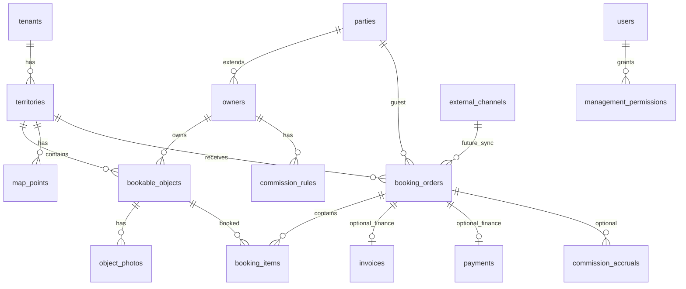

# Flexity Booking — модель данных

Концептуальная схема сущностей модуля Booking. Имена таблиц и полей — рабочие; финальная схема фиксируется в [IMPLEMENTATION_PLAN_E1.md](./IMPLEMENTATION_PLAN_E1.md) после approval.

## Общие правила

| Правило | Описание |
|---------|----------|
| Tenant isolation | Все booking-таблицы содержат `tenant_id` (FK → tenants) |
| Timestamps | Хранить в **UTC** (`timestamptz`) |
| Business/UI timezone | Брать из `territories.timezone` (IANA) |
| Check-in / check-out | Хранить как **local time** territory (`time`); при расчёте интервалов конвертировать в UTC instant |
| Domain vs finance | `booking_orders` / `booking_items` — **доменные** сущности бронирования; счета и оплаты — **finance**, не дублировать |
| Audit | Через Core **AuditRecorder**, отдельная `booking_audit_logs` не создаётся |
| PK | UUID — в стиле Flexity Core |

### Правило времени (check-in / check-out)

```
territory.timezone = "Asia/Almaty"
territory.default_check_in_time  = 14:00   -- local time
territory.default_check_out_time = 12:00   -- local time

bookable_object.check_in_time  = 15:00     -- optional override, local time
bookable_object.check_out_time = 11:00     -- optional override, local time

booking_item.check_in_at  = timestamptz    -- UTC instant = local date + check_in_time @ territory TZ
booking_item.check_out_at = timestamptz    -- UTC instant = local date + check_out_time @ territory TZ
```

Hold expiry (`hold_expires_at`) — UTC instant. UI countdown — local time territory.

## ER-диаграмма (high level)



---

## 1. `territories`

Контур бронирования.

| Поле | Тип | Описание |
|------|-----|----------|
| id | UUID | PK |
| tenant_id | UUID | FK tenants |
| code | string | Уникален в tenant |
| name | string | |
| slug | string | Публичный URL segment |
| timezone | string | IANA, напр. `Asia/Almaty` |
| currency | string | ISO 4217 |
| default_check_in_time | time | Local time territory |
| default_check_out_time | time | Local time territory |
| hold_duration_minutes | int | MVP: 30 |
| min_stay_nights | int | |
| map_config_json | jsonb | Фон, размеры, layers |
| settings_json | jsonb | Payment instructions, WhatsApp phone, 2GIS notes |
| status | enum | draft / active / archived |
| created_at, updated_at | timestamptz | UTC |

**MVP:** одна `active` territory на tenant (application-level).

---

## 2. `owners` (parties extension)

Владелец объектов; **не** дублирует parties.

| Поле | Тип | Описание |
|------|-----|----------|
| id | UUID | PK |
| tenant_id | UUID | FK |
| party_id | UUID | FK parties (person/org) |
| display_name | string | UI override |
| payout_details_json | jsonb | Post-MVP payout |
| telegram_chat_id | string | nullable |
| whatsapp_phone | string | nullable, для ops |
| status | enum | active / suspended |
| created_at, updated_at | timestamptz | UTC |

Guest **не** создаёт owner record — только party как client.

---

## 3. `bookable_objects`

Объект бронирования.

| Поле | Тип | Описание |
|------|-----|----------|
| id | UUID | PK |
| tenant_id | UUID | FK |
| territory_id | UUID | FK territories |
| owner_id | UUID | FK owners |
| code | string | Уникален в territory |
| name | string | |
| description | text | |
| object_type | enum | cabin / zone / hall / other |
| capacity | int | |
| base_price | decimal | |
| pricing_unit | enum | per_night / per_stay |
| check_in_time | time | nullable override, **local time territory** |
| check_out_time | time | nullable override, **local time territory** |
| catalog_item_id | UUID | nullable FK catalog (future marketplace) |
| status | enum | active / maintenance / unlisted |
| sort_order | int | |
| metadata_json | jsonb | Amenities |
| created_at, updated_at | timestamptz | UTC |

---

## 4. `object_photos`

Фото объекта для публичной карточки и админки.

| Поле | Тип | Описание |
|------|-----|----------|
| id | UUID | PK |
| tenant_id | UUID | FK |
| bookable_object_id | UUID | FK |
| file_storage_id | UUID | nullable FK documents/file storage |
| url | string | nullable external URL |
| alt_text | string | |
| sort_order | int | Cover = 0 |
| created_at | timestamptz | UTC |

MVP: 1–10 фото на object; хранение через существующий file storage Flexity (post-E1 decision).

---

## 5. `map_points`

Точка объекта на схеме territory.

| Поле | Тип | Описание |
|------|-----|----------|
| id | UUID | PK |
| tenant_id | UUID | FK |
| territory_id | UUID | FK |
| bookable_object_id | UUID | FK, unique |
| x | float | 0–1 normalized или px |
| y | float | |
| label | string | |
| layer | string | default `main` |
| created_at, updated_at | timestamptz | UTC |

---

## 6. `booking_orders`

**Доменный** заказ бронирования (header). Не заменяет finance invoice.

| Поле | Тип | Описание |
|------|-----|----------|
| id | UUID | PK |
| tenant_id | UUID | FK |
| territory_id | UUID | FK |
| order_number | string | |
| guest_party_id | UUID | FK parties |
| status | enum | см. ниже |
| hold_expires_at | timestamptz | UTC |
| currency | string | |
| subtotal | decimal | |
| commission_total | decimal | Snapshot at confirm |
| notes | text | |
| source | enum | public_web / admin / 2gis / external |
| work_item_id | UUID | nullable FK workflows |
| invoice_id | UUID | nullable FK finance.invoices |
| payment_id | UUID | nullable FK finance.payments |
| confirmed_at | timestamptz | UTC |
| cancelled_at | timestamptz | UTC |
| created_by_user_id | UUID | nullable |
| created_at, updated_at | timestamptz | UTC |

### Статусы

```
draft → held → pending_payment → paid → confirmed
                ↘ cancelled
                ↘ expired
```

Finance создаёт invoice/payment **по ссылке**, не копирует строки booking в finance tables.

---

## 7. `booking_items`

**Доменная** строка брони — один object + интервал.

| Поле | Тип | Описание |
|------|-----|----------|
| id | UUID | PK |
| tenant_id | UUID | FK |
| booking_order_id | UUID | FK |
| bookable_object_id | UUID | FK |
| check_in_date | date | Local calendar date territory |
| check_out_date | date | Local calendar date territory |
| check_in_at | timestamptz | UTC instant |
| check_out_at | timestamptz | UTC instant |
| nights | int | |
| unit_price | decimal | Snapshot |
| line_total | decimal | |
| owner_id | UUID | Denormalized |
| status | enum | mirrors order or item cancel |
| created_at, updated_at | timestamptz | UTC |

Availability: интервалы `[check_in_at, check_out_at)` не пересекаются для confirmed + active held.

---

## 8. `management_permissions`

Fine-grain ACL управления объектами.

| Поле | Тип | Описание |
|------|-----|----------|
| id | UUID | PK |
| tenant_id | UUID | FK |
| user_id | UUID | FK users |
| scope_type | enum | territory / owner / object |
| scope_id | UUID | |
| permission | enum | view / manage / finance / notify |
| granted_by_user_id | UUID | |
| created_at | timestamptz | UTC |

Unique: `(tenant_id, user_id, scope_type, scope_id, permission)`.

---

## 9. `commissions`

### 9.1 `commission_rules`

| Поле | Тип | Описание |
|------|-----|----------|
| id | UUID | PK |
| tenant_id | UUID | FK |
| territory_id | UUID | nullable |
| owner_id | UUID | nullable |
| rate_percent | decimal | |
| fixed_fee | decimal | nullable |
| effective_from | date | |
| effective_to | date | nullable |

### 9.2 `commission_accruals` (post-MVP payout)

| Поле | Тип | Описание |
|------|-----|----------|
| id | UUID | PK |
| booking_order_id | UUID | FK |
| owner_id | UUID | FK |
| gross_amount | decimal | |
| commission_amount | decimal | |
| net_owner_amount | decimal | |
| status | enum | accrued / paid |
| created_at | timestamptz | UTC |

MVP: snapshot в `booking_orders.commission_total`; accruals optional.

---

## 10. Audit (Core AuditRecorder)

**Не отдельная таблица booking.** События через `modules/audit`:

| entity_type | Примеры action |
|-------------|----------------|
| booking_order | create, status_change, payment_confirm |
| booking_item | create, cancel |
| bookable_object | create, update |
| territory | update settings |

metadata_json: `old_status`, `new_status`, `source`, `user_id`.

---

## 11. `external_channels` (future)

Не создавать в E1. Концептуально:

### `external_channel_connections`

| channel_type | Примеры |
|--------------|---------|
| ota | Booking.com-class |
| whatsapp_api | Meta Business API |
| api | Partner webhook |

### `external_booking_refs`

Mapping `external_id` ↔ `booking_order_id` для idempotent sync.

---

## 12. Core tables — переиспользуются, не дублируются

| Core | Связь |
|------|-------|
| tenants | tenant_id |
| users | management_permissions, created_by |
| parties | guest_party_id, owners.party_id |
| finance.invoices | booking_orders.invoice_id |
| finance.payments | booking_orders.payment_id |
| workflows.work_items | booking_orders.work_item_id |
| audit (universal) | AuditRecorder events |

---

## 13. Индексы (рекомендации)

| Таблица | Индекс |
|---------|--------|
| booking_items | `(bookable_object_id, check_in_at, check_out_at)` |
| booking_orders | `(tenant_id, status, hold_expires_at)` |
| booking_orders | `(territory_id, created_at DESC)` |
| bookable_objects | `(territory_id, status)` |
| object_photos | `(bookable_object_id, sort_order)` |
| management_permissions | `(user_id, tenant_id)` |

---

## 14. Связанные документы

- [README.md](./README.md)
- [PRODUCT_CONCEPT.md](./PRODUCT_CONCEPT.md)
- [MVP_SCOPE.md](./MVP_SCOPE.md)
- [FLEXITY_INTEGRATION.md](./FLEXITY_INTEGRATION.md)
- [IMPLEMENTATION_PLAN_E1.md](./IMPLEMENTATION_PLAN_E1.md)
